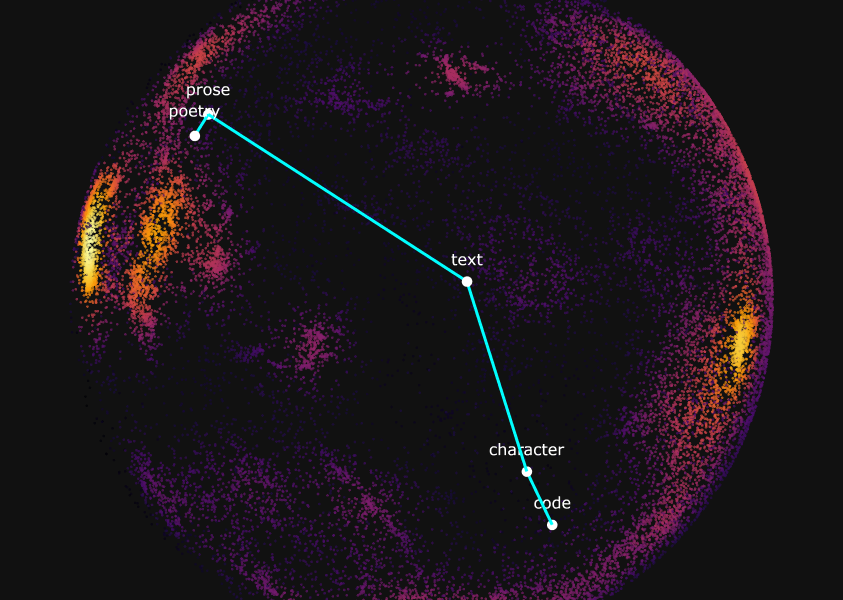

# Senseflow
[](https://github.com/oakto/senseflow)
[](https://huggingface.co/spaces/oako/senseflow)

$$\text{sense} \rightarrow\ \text{vibe} \rightarrow\ \text{rhythm} \rightarrow\ \text{flow} $$
$$\text{war} \rightarrow\ \text{hostilities} \rightarrow\ \text{truce} \rightarrow\ \text{peace}$$
$$\text{code} \rightarrow\ \text{character} \rightarrow\ \text{text} \rightarrow\ \text{prose} \rightarrow\ \text{poetry}$$


Senseflow is a semantic word morpher that generates meaningful intermediate word sequences between two input words.

<p align="center">
  
</p>
<p align="center">
  <em>3D semantic manifold visualized with UMAP.</em>
</p>

See the [report](./REPORT.md) for more details.

## Installation

### Setup

1. Clone the repository and navigate to the project directory:

```bash
git clone https://github.com/oakto/senseflow
cd senseflow
```

2. Install the dependencies:

```bash
pip install -r requirements.txt
```

3. Install PyTorch:

For CUDA:
```bash
pip3 install torch torchvision --index-url https://download.pytorch.org/whl/cu128
```
For CPU only:
```bash
pip3 install torch torchvision --index-url https://download.pytorch.org/whl/cpu
```

For other versions, see the [official installation guide](https://pytorch.org/get-started/locally).

## Usage
If you want to use directly, you can skip to the [Inference](#inference) section.
### Data Preprocessing and Training
*Note: A CUDA-enabled GPU and adequate system memory are recommended.*

The full process can be run with the following command:
```bash
python -m scripts.run
```
You can also run each step separately in the following order:
```bash
python -m src.data.init
python -m src.data.samples
python -m src.data.embeddings 
python -m src.data.centroids
python -m src.data.pairs
python -m src.data.displacements
python -m src.model.train
python -m src.visualize.semantic_manifold
```
Completion of the steps above should produce the following files.

In the `./data/` directory:
- `samples.jsonl`
- `raw_embeddings.bin`, `embeddings.bin`, `embedding_metadata.json`
- `centroids.bin`, `centroid_metadata.json`
- `pairs.csv`
- `displacements.bin`, `displacement_indices.npy`, `displacement_metadata.json`
- `semantic_manifold.npz`

In the `./checkpoints/` directory:
- `model_epoch_<epoch>.pth`

*Please note that the repository may receive future updates. You may need to rerun the data preprocessing and training steps if compatibility issues arise.* 

#### Download Files
The above files can be downloaded from the following links:
1. [Data](https://huggingface.co/datasets/oako/senseflow/tree/main)
2. [Model checkpoints](https://huggingface.co/oako/senseflow/tree/main)

Place them in the appropriate directories as shown above.

### Inference
#### Gradio Interface (Recommended)
Run the following command to launch the interactive interface. This will also automatically download all required assets.
```bash
python -m src.interface.app
```
#### Command Line Interface (CLI)
The CLI uses the same assets as the Gradio app. Run the Gradio interface once to download the required files before using the CLI.

Arguments in square brackets are optional.
```bash
python -m scripts.flow \
    --start <start_word> \
    --end <end_word> \
    [--config <path to config file>] \
    [--k-neighbors <k_neighbors_of_kdtree>] \
    [--max-neighbor-distance <max_neighbor_distance_of_kdtree>] \
    [--k-cutoff <k_cutoff_of_kdtree>] \
    [--temperature <sampling_temperature>] \
    [--max-expansions <max_node_expansions>] \
    [--weights <step_weight> <lemma_weight> <flow_weight>] \
    [--allow-immediate-reach]
```

Senseflow is also available on Hugging Face Spaces. See the link above.

### Parameters
|Parameter|Description|Recommended Range|Default Value|
|---|---|---|---|
|k-neighbors|Number of nearest neighbors to collect at each step|20-100|30|
|max-neighbor-distance|Maximum distance to be considered a neighbor|1.0-1.5|1.1|
|k-cutoff|Number of nearest neighbors to sample from when temperature > 0|≤ k-neighbors|20|
|temperature|Controls randomness of neighbor sampling|0.0-1.0|0.1|
|max-expansions|Maximum node expansions in A\* search|≥100|3000|
|step-weight|Weight for step distance|0.0-1.0|1.0|
|lemma-weight|Weight for lemma repetition penalty|0.0-5.0|1.5|
|flow-weight|Weight for flow alignment|0.0-5.0|2.0|
|allow-immediate-reach|Allows immediate reach of the target word|True/False|True|

## Remarks
### Semantic shift
Sometimes a path may use different senses of a word as a semantic bridge to move to another context. For example: `python → extension → feature → dock_0 → dock_1 → pond`. The number after the word is the sense index, which is derived from the centroid computation step in data preprocessing.
### Limitations
- Only common English words are supported.
- The quality of the generated paths is not guaranteed and depends on the hyperparameters.
- It may not work well with number words or word pairs that are semantically too far apart.